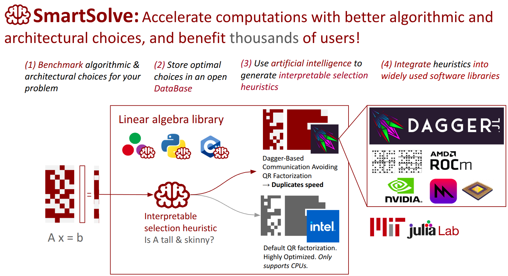

## How to start

In the following example SmartSolve is used to automatically generate SmartLU, an optimized version of the LU decomposition.

```bash
cd SmartSolve/examples/smartlu
julia --project=.
```

```julia
pkg> dev ../..
pkg> instantiate
julia> include("generate_smartlu.jl")
```

## References

- Rushil Shah, Emmanuel Lujan, and Rabab Alomairy. _"Automated Algorithm Selection Discovery via LLMs,"_ JuliaCon 2025, Lightning Talk [(link)](https://pretalx.com/juliacon-2025/talk/review/FXWAYZEZ9XEPYPHL3JJNAS7NBACU3GXE).
- Alan Edelman’s keynote talk. _"Improving the HPC experience, did Julia get it right or will AI hide the problem (or both)?"_. Workshop on Asynchronous Many-Task Systems and Applications (WAMTA), 2025 [(link)](https://wamta25.github.io/keynote).
- Rabab Alomairy, Felipe Tome, Julian Samaroo, Alan Edelman. _"Dynamic Task Scheduling with Data Dependency Awareness Using Julia"_, 2024 IEEE High Performance Extreme Computing Conference (HPEC) [(link)](https://ieeexplore.ieee.org/document/10938467).
- SmartSolve article (in preparation)


## Acknowledgements

We thank [DARPA](https://www.darpa.mil/research/programs/mathematics-for-the-discovery-of-algorithms-and-architectures) for supporting this work at MIT.


